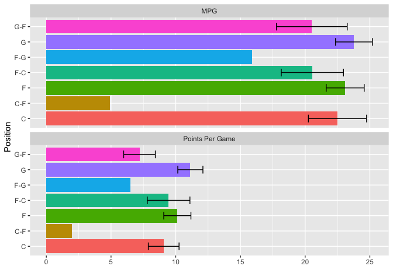
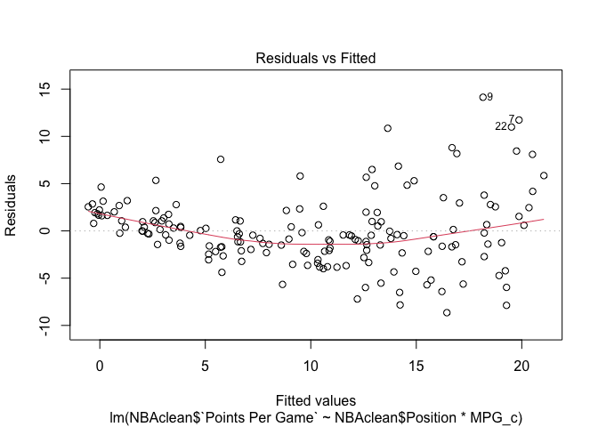
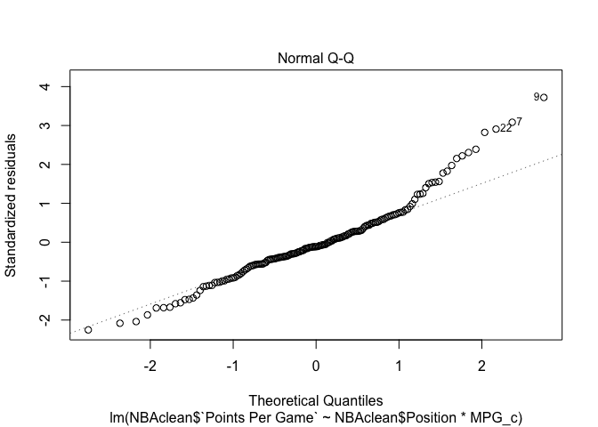

Project 2
================
Gabriella Cerrato (gac2625)
4/15/2021

## R Markdown

This is an R Markdown document. Markdown is a simple formatting syntax
for authoring HTML, PDF, and MS Word documents. For more details on
using R Markdown see <http://rmarkdown.rstudio.com>.

When you click the **Knit** button a document will be generated that
includes both content as well as the output of any embedded R code
chunks within the document. You can embed an R code chunk like this:

\#I have chosen to explore data regarding the salaries and game
statistics of NBA players during the 2018-2019 basketball season. I have
chosen a dataset of the salaries of NBA players during the 2018-2019
season (<https://hoopshype.com/salaries/2018-2019/>) as well as a
dataset of game statistics
(<https://www.nbastuffer.com/2018-2019-nba-player-stats/>) that included
data of the number of minutes played per game, points scored per game,
age of the players, etc.. I chose this data set because I thought it
would be interesting to see how the salaries earned by the players
relates to their performance in games. In the joined dataset, there are
33 columns, 169 rows, and a total of 593 observations. . The variables I
chose to focus on in this project were the minutes played per game,
points played per game, position, age, and salaries of the NBA players.
I think the relationship between positions and salary, points scored and
minutes played would be interesting to investigate because different
basketball positions have different roles that are not always about
scoring points.

``` r
#data set of the game statistics of NBA players during the 2018-2019 season
library(readxl)
NBAplayerstats <- read_excel("~/Downloads/2018-2019 NBA Player Stats.project2.xlsx")
```

    ## New names:
    ## * `` -> ...2
    ## * `` -> ...3
    ## * `` -> ...4
    ## * `` -> ...5
    ## * `` -> ...6
    ## * ...

``` r
View(NBAplayerstats)

#data set of the salaries of NBA players during the 2018-2019 season
library(readxl)
NBA_salaries <- read_excel("~/Downloads/NBA salaries.project2.xlsx")
```

    ## New names:
    ## * `` -> ...4

``` r
View(NBA_salaries)

#to tidy the data set of the salaries earned by players, I removed a redundant column that specified row number and removed a column of the salaries adjusted for inflation
NBAsalaries <- subset(NBA_salaries, select = -c(1, 4)) %>% 
#I renamed the columns in the salary data set
  rename("NAME" = 1, "Salary ($)" = 2)

#In the second data set, I also renamed some columns for clarity and brevity. MPG stands for minutes played per game, etc. 
NBAplayerstats <- subset(NBAplayerstats, select = -c(1)) %>%
  rename(
   "NAME" = 1, "TEAM" = 2, "Position" =  3, "Age" = 4, "GP" = 5, "MPG" = 6,  "Percentage of Team Minutes Used" = 7, "Usage Rate" = 8, "Turnover Rate" = 9, "FTA" = 10, "FT%" = 11, "2PA" = 12, "2P%" = 13, "3PA" = 14, "3P%" = 15, "Effective Shooting %" = 16, "True Shooting %" = 17, "Points Per Game" = 18, "Rebounds Per Game"= 19, "Total Rebound Percentage" = 20, "Assists Per Game" = 21, "Assists %" = 22, "Steals Per Game" = 23, "Blocks Per Game" = 24, "Turnovers Per Game" = 25, "Versatility Index" = 26, "Offensive Rating" = 27, "Defensive Rating" = 28)  

#I used full join to join the data sets. The common variable used to join the data set was the name of the player.
NBA <- NBAsalaries %>% 
  full_join(NBAplayerstats, by = c("NAME"))

# I removed NAs from the joined data set. 424 cases were dropped because the salary data set included every single player in the league, but there were not game stats for every single player in the league in the other data set. Following NA removal, the joined data set has 593 observations. 
NBAclean <- NBA %>% drop_na()
```

``` r
#convert observation from character to factor
summary(NBAclean)
```

    ##      NAME             Salary ($)           TEAM             Position        
    ##  Length:169         Min.   :   77250   Length:169         Length:169        
    ##  Class :character   1st Qu.: 2165481   Class :character   Class :character  
    ##  Mode  :character   Median : 7000000   Mode  :character   Mode  :character  
    ##                     Mean   : 9916752                                        
    ##                     3rd Qu.:14800000                                        
    ##                     Max.   :37457154                                        
    ##      Age                 GP                MPG           
    ##  Length:169         Length:169         Length:169        
    ##  Class :character   Class :character   Class :character  
    ##  Mode  :character   Mode  :character   Mode  :character  
    ##                                                          
    ##                                                          
    ##                                                          
    ##  Percentage of Team Minutes Used  Usage Rate        Turnover Rate     
    ##  Length:169                      Length:169         Length:169        
    ##  Class :character                Class :character   Class :character  
    ##  Mode  :character                Mode  :character   Mode  :character  
    ##                                                                       
    ##                                                                       
    ##                                                                       
    ##      FTA                FT%                2PA                2P%           
    ##  Length:169         Length:169         Length:169         Length:169        
    ##  Class :character   Class :character   Class :character   Class :character  
    ##  Mode  :character   Mode  :character   Mode  :character   Mode  :character  
    ##                                                                             
    ##                                                                             
    ##                                                                             
    ##      3PA                3P%            Effective Shooting % True Shooting %   
    ##  Length:169         Length:169         Length:169           Length:169        
    ##  Class :character   Class :character   Class :character     Class :character  
    ##  Mode  :character   Mode  :character   Mode  :character     Mode  :character  
    ##                                                                               
    ##                                                                               
    ##                                                                               
    ##  Points Per Game    Rebounds Per Game  Total Rebound Percentage
    ##  Length:169         Length:169         Length:169              
    ##  Class :character   Class :character   Class :character        
    ##  Mode  :character   Mode  :character   Mode  :character        
    ##                                                                
    ##                                                                
    ##                                                                
    ##  Assists Per Game    Assists %         Steals Per Game    Blocks Per Game   
    ##  Length:169         Length:169         Length:169         Length:169        
    ##  Class :character   Class :character   Class :character   Class :character  
    ##  Mode  :character   Mode  :character   Mode  :character   Mode  :character  
    ##                                                                             
    ##                                                                             
    ##                                                                             
    ##  Turnovers Per Game Versatility Index  Offensive Rating   Defensive Rating  
    ##  Length:169         Length:169         Length:169         Length:169        
    ##  Class :character   Class :character   Class :character   Class :character  
    ##  Mode  :character   Mode  :character   Mode  :character   Mode  :character  
    ##                                                                             
    ##                                                                             
    ## 

``` r
  NBAclean <- NBAclean %>% mutate_at(c(2, 5:29),as.numeric)
  NBAclean %>% mutate_if(is.character,as.factor)
```

    ## # A tibble: 169 x 29
    ##    NAME      `Salary ($)` TEAM  Position   Age    GP   MPG `Percentage of Team …
    ##    <fct>            <dbl> <fct> <fct>    <dbl> <dbl> <dbl>                 <dbl>
    ##  1 Stephen …     37457154 Gol   G         31.2    22  38.4                  80.1
    ##  2 Russell …     35665000 Okc   G         30.6     5  39.4                  82.2
    ##  3 Chris Pa…     35654150 Hou   G         34.1    11  36.1                  75.3
    ##  4 Kyle Low…     32700000 Tor   G         33.2    24  37.5                  78.2
    ##  5 Blake Gr…     31873932 Det   F         30.2     2  29.1                  60.5
    ##  6 Gordon H…     31214295 Bos   F         29.2     9  29.6                  61.7
    ##  7 James Ha…     30570000 Hou   G         29.8    11  38.6                  80.3
    ##  8 Paul Geo…     30560700 Okc   F         29.1     5  40.8                  85  
    ##  9 Kevin Du…     30000000 Gol   F         30.7    12  36.8                  76.7
    ## 10 Paul Mil…     29230769 Den   F         34.3    14  33.5                  69.8
    ## # … with 159 more rows, and 21 more variables: Usage Rate <dbl>,
    ## #   Turnover Rate <dbl>, FTA <dbl>, FT% <dbl>, 2PA <dbl>, 2P% <dbl>, 3PA <dbl>,
    ## #   3P% <dbl>, Effective Shooting % <dbl>, True Shooting % <dbl>,
    ## #   Points Per Game <dbl>, Rebounds Per Game <dbl>,
    ## #   Total Rebound Percentage <dbl>, Assists Per Game <dbl>, Assists % <dbl>,
    ## #   Steals Per Game <dbl>, Blocks Per Game <dbl>, Turnovers Per Game <dbl>,
    ## #   Versatility Index <dbl>, Offensive Rating <dbl>, Defensive Rating <dbl>

``` r
#I explored how the variable of minutes played per game and points scored per game differ across positions
  NBAclean %>%
  group_by(Position) %>%
  summarize(mean(MPG), mean(`Points Per Game`))
```

    ## # A tibble: 7 x 3
    ##   Position `mean(MPG)` `mean(\`Points Per Game\`)`
    ##   <chr>          <dbl>                       <dbl>
    ## 1 C               22.5                        9.07
    ## 2 C-F              4.9                        2   
    ## 3 F               23.1                       10.1 
    ## 4 F-C             20.6                        9.45
    ## 5 F-G             15.9                        6.5 
    ## 6 G               23.8                       11.1 
    ## 7 G-F             20.5                        7.2

``` r
#The position C-F has the lowest mean minutes played per game and mean points scored per game. This is likely due to only player having this position in the data set. 
  
NBAclean %>%
  group_by(Position) %>%
  summarize(mean(`Salary ($)`))  
```

    ## # A tibble: 7 x 2
    ##   Position `mean(\`Salary ($)\`)`
    ##   <chr>                     <dbl>
    ## 1 C                     10859549.
    ## 2 C-F                    2393887 
    ## 3 F                      9969449.
    ## 4 F-C                   12549472.
    ## 5 F-G                    9367200 
    ## 6 G                      9410541.
    ## 7 G-F                    9181862.

``` r
#The position F-C has the highest salary of all of the positions 

# Represent with a graph 
NBAclean %>%
  select(Position, MPG, 'Points Per Game') %>%
  pivot_longer(-1,names_to='DV', values_to='measure') %>%
  ggplot(aes(Position,measure,fill= Position)) +
  geom_bar(stat="summary", fun = "mean") +
  geom_errorbar(stat="summary", fun.data = "mean_se", width=.5) +
  facet_wrap(~DV, nrow=2) +
  coord_flip() + 
  ylab("") + 
  theme(legend.position = "none")
```

<!-- -->

``` r
#investigate how points per game is correlated with minutes played per game with correlation coefficient 
cor(NBAclean$MPG, NBAclean$`Points Per Game`)
```

    ## [1] 0.839516

``` r
#calculate the mean and standard deviation of the minutes played per game 
NBAclean %>%
    summarize(mean_MPG= mean(MPG), st_dev_MPG = sd(MPG))
```

    ## # A tibble: 1 x 2
    ##   mean_MPG st_dev_MPG
    ##      <dbl>      <dbl>
    ## 1     22.7       10.8

``` r
#calculate the mean and standard deviation of the points scored per game 
NBAclean %>%
    summarize(mean_PPG = mean(NBAclean$`Points Per Game`), st_dev_PPG = sd(NBAclean$`Points Per Game`))
```

    ## # A tibble: 1 x 2
    ##   mean_PPG st_dev_PPG
    ##      <dbl>      <dbl>
    ## 1     9.97       7.17

``` r
# Perform MANOVA with 2 response variables listed in cbind()
manova_position <- manova(cbind(NBAclean$MPG,NBAclean$`Points Per Game`) ~ Position, data = NBAclean)

# Output of MANOVA
summary(manova_position)
```

    ##            Df   Pillai approx F num Df den Df Pr(>F)
    ## Position    6 0.061928  0.86275     12    324 0.5855
    ## Residuals 162

``` r
# If MANOVA is significant then we can perform one-way ANOVA for each variable
  summary.aov(manova_position)
```

    ##  Response 1 :
    ##              Df  Sum Sq Mean Sq F value Pr(>F)
    ## Position      6   581.4  96.898  0.8222 0.5542
    ## Residuals   162 19092.0 117.852               
    ## 
    ##  Response 2 :
    ##              Df Sum Sq Mean Sq F value Pr(>F)
    ## Position      6  310.8  51.805  1.0091 0.4213
    ## Residuals   162 8316.4  51.336

``` r
#A one way MANOVA was performed to determine the effect of position on the dependent variables minutes played per game and points scored per game. The null hypothesis failed to be rejected so the points scored per game and minutes played per game do not differ across positions. Because the MANOVA was not significant, no post-hoc analysis was necessary. The p-value associated with the F-statistic is 0.5855, which is greater than .05. The approximate F value is 0.86275 and Pillai's trace is 0.06.
  
  
#Run ANOVA to compare the length by different doses
summary(aov(NBAclean$`Points Per Game` ~ NBAclean$Position, data = NBAclean))
```

    ##                    Df Sum Sq Mean Sq F value Pr(>F)
    ## NBAclean$Position   6    311   51.81   1.009  0.421
    ## Residuals         162   8316   51.34

``` r
#probability of a type 1 error
#I ran one MANOVA test that was not significant 
1- 0.95^(1)
```

    ## [1] 0.05

``` r
#the probability of a type 1 error is .05
```

``` r
#Run ANOVA to find F statistic for the relationship between points per game and position
summary(aov(NBAclean$`Points Per Game` ~ NBAclean$Position, data = NBAclean))
```

    ##                    Df Sum Sq Mean Sq F value Pr(>F)
    ## NBAclean$Position   6    311   51.81   1.009  0.421
    ## Residuals         162   8316   51.34

``` r
obs_F <- 1.009

#Null hypothesis: The mean points per game is the same for each different position. Alternate hypothesis: The mean points per game is different for each different position.

# Randomization test (using replicate)
Fs <- replicate(5000,{
  # Randomly permute the response variable across positions
  new <- NBAclean %>%
    mutate(`Points Per Game` = sample(`Points Per Game`))
  # Compute variation within groups
  SSW <- new %>%
    group_by(Position) %>%
    summarize(SSW = sum((`Points Per Game` - mean(`Points Per Game`))^2)) %>%
    summarize(sum(SSW)) %>% 
    pull
  # Compute variation between groups
  SSB <- new %>% 
    mutate(mean = mean(`Points Per Game`)) %>%
    group_by(Position) %>% 
    mutate(groupmean = mean(`Points Per Game`)) %>%
    summarize(SSB = sum((mean - groupmean)^2)) %>%
    summarize(sum(SSB)) %>%
    pull
  # Compute the F-statistic (ratio of MSB and MSW)
  # df for SSB is 7 groups - 1 = 6
  # df for SSW is 169 observations - 7 groups = 162
  (SSB/6)/(SSW/57)
})

# Represent the distribution of the F-statistics for each randomized sample
hist(Fs, prob=T, main = "Distribution of Sampled F-statistics"); abline(v = obs_F, col="red",add=T)
```

    ## Warning in int_abline(a = a, b = b, h = h, v = v, untf = untf, ...): "add" is
    ## not a graphical parameter

<!-- -->

``` r
# Calculate the proportion of F statistic that are greater than the observed F-statistic
mean(Fs > obs_F)
```

    ## [1] 0.0116

``` r
#the proportion is 0.0122
```

``` r
#mean center the variable points per game 
NBAclean$Points_Per_Game_c <- NBAclean$`Points Per Game` - mean(NBAclean$`Points Per Game`, na.rm = TRUE)

#mean center the variable minutes per game(MPG)
NBAclean$MPG_c <- NBAclean$`MPG` - mean(NBAclean$`MPG`, na.rm = TRUE)

#mean mean center the variable salary
NBAclean$Salary_c <- NBAclean$`Salary ($)` - mean(NBAclean$`Salary ($)`, na.rm = TRUE)

#regression model
#option 1
fit_c1 <- lm(NBAclean$`Points Per Game` ~ NBAclean$Position * MPG_c, data = NBAclean)
summary(fit_c1)
```

    ## 
    ## Call:
    ## lm(formula = NBAclean$`Points Per Game` ~ NBAclean$Position * 
    ##     MPG_c, data = NBAclean)
    ## 
    ## Residuals:
    ##    Min     1Q Median     3Q    Max 
    ## -8.651 -2.106 -0.421  1.743 14.138 
    ## 
    ## Coefficients: (2 not defined because of singularities)
    ##                            Estimate Std. Error t value Pr(>|t|)    
    ## (Intercept)                 9.15573    0.89268  10.256  < 2e-16 ***
    ## NBAclean$PositionC-F        0.92202    4.31780   0.214    0.831    
    ## NBAclean$PositionF          0.73225    1.03320   0.709    0.480    
    ## NBAclean$PositionF-C        1.47529    1.46580   1.006    0.316    
    ## NBAclean$PositionF-G        0.42799    4.03886   0.106    0.916    
    ## NBAclean$PositionG          1.33641    1.01948   1.311    0.192    
    ## NBAclean$PositionG-F       -1.10516    1.31238  -0.842    0.401    
    ## MPG_c                       0.45400    0.09358   4.852 2.93e-06 ***
    ## NBAclean$PositionC-F:MPG_c       NA         NA      NA       NA    
    ## NBAclean$PositionF:MPG_c    0.13251    0.10505   1.261    0.209    
    ## NBAclean$PositionF-C:MPG_c  0.09943    0.16919   0.588    0.558    
    ## NBAclean$PositionF-G:MPG_c       NA         NA      NA       NA    
    ## NBAclean$PositionG:MPG_c    0.13551    0.10327   1.312    0.191    
    ## NBAclean$PositionG-F:MPG_c -0.06287    0.12729  -0.494    0.622    
    ## ---
    ## Signif. codes:  0 '***' 0.001 '**' 0.01 '*' 0.05 '.' 0.1 ' ' 1
    ## 
    ## Residual standard error: 3.89 on 157 degrees of freedom
    ## Multiple R-squared:  0.7246, Adjusted R-squared:  0.7053 
    ## F-statistic: 37.55 on 11 and 157 DF,  p-value: < 2.2e-16

``` r
#Only the position C had a significant effect on points scored per game. Its p value was 2e-16 and less than 0.05.

  #plot the point per game by minutes per game 
  NBAclean %>% ggplot(aes(x = MPG_c, y = `Points Per Game`, color = Position)) +
  geom_smooth(method=lm) 
```

    ## `geom_smooth()` using formula 'y ~ x'

<!-- -->

``` r
# Linearity and homoscedasticity
plot(fit_c1, which = 1)
```

<!-- -->

``` r
#The red line is approximately horizontal at 0, so it passes the linearity assumption

#homoscedasticity
bptest(fit_c1)
```

    ## 
    ##  studentized Breusch-Pagan test
    ## 
    ## data:  fit_c1
    ## BP = 32.953, df = 11, p-value = 0.0005354

``` r
#the p value is less than 0.05, so the assumption has not been violated

# Normality
plot(fit_c1, which = 2)
```

    ## Warning: not plotting observations with leverage one:
    ##   69, 124

<!-- -->

``` r
#The residual points follow a straight line, so they are normally distributed 

shapiro.test(fit_c1$residuals)
```

    ## 
    ##  Shapiro-Wilk normality test
    ## 
    ## data:  fit_c1$residuals
    ## W = 0.95557, p-value = 3.427e-05

``` r
#graph the relationship
ggplot3 <- ggplot(NBAclean, aes(x = MPG, y = `Points Per Game`, color = Position)) + 
  geom_point() + 
  geom_smooth(method = 'lm', se = FALSE) +
  labs(title ="Minutes Played Per Game vs. Points Scored Per Game", 
       x = "Minutes Played Per Game", y = "Points Scored Per Game")
ggplot3
```

    ## `geom_smooth()` using formula 'y ~ x'

<!-- -->

``` r
# Fit a regression model
fit <- lm(NBAclean$`Points Per Game` ~ NBAclean$Position * MPG_c, data = NBAclean)

# Uncorrected Standard Errors
summary(fit)$coef
```

    ##                               Estimate Std. Error    t value     Pr(>|t|)
    ## (Intercept)                 9.15572915 0.89267701 10.2564859 3.263382e-19
    ## NBAclean$PositionC-F        0.92201601 4.31780258  0.2135383 8.311842e-01
    ## NBAclean$PositionF          0.73224861 1.03319983  0.7087193 4.795497e-01
    ## NBAclean$PositionF-C        1.47528870 1.46579641  1.0064759 3.157354e-01
    ## NBAclean$PositionF-G        0.42799285 4.03886202  0.1059687 9.157425e-01
    ## NBAclean$PositionG          1.33640580 1.01947886  1.3108715 1.918154e-01
    ## NBAclean$PositionG-F       -1.10515752 1.31238313 -0.8420998 4.010130e-01
    ## MPG_c                       0.45400211 0.09357682  4.8516512 2.927166e-06
    ## NBAclean$PositionF:MPG_c    0.13251111 0.10504968  1.2614138 2.090308e-01
    ## NBAclean$PositionF-C:MPG_c  0.09943371 0.16919424  0.5876897 5.575849e-01
    ## NBAclean$PositionG:MPG_c    0.13550768 0.10327409  1.3121169 1.913959e-01
    ## NBAclean$PositionG-F:MPG_c -0.06287366 0.12729286 -0.4939292 6.220465e-01

``` r
# Robust Standard Errors
library(sandwich)
coeftest(fit, vcov = vcovHC(fit))
```

    ## 
    ## t test of coefficients:
    ## 
    ##                             Estimate Std. Error t value Pr(>|t|)
    ## (Intercept)                 9.155729         NA      NA       NA
    ## NBAclean$PositionC-F        0.922016         NA      NA       NA
    ## NBAclean$PositionF          0.732249         NA      NA       NA
    ## NBAclean$PositionF-C        1.475289         NA      NA       NA
    ## NBAclean$PositionF-G        0.427993         NA      NA       NA
    ## NBAclean$PositionG          1.336406         NA      NA       NA
    ## NBAclean$PositionG-F       -1.105158         NA      NA       NA
    ## MPG_c                       0.454002         NA      NA       NA
    ## NBAclean$PositionF:MPG_c    0.132511         NA      NA       NA
    ## NBAclean$PositionF-C:MPG_c  0.099434         NA      NA       NA
    ## NBAclean$PositionG:MPG_c    0.135508         NA      NA       NA
    ## NBAclean$PositionG-F:MPG_c -0.062874         NA      NA       NA

``` r
#bootstrap repeated 5000 times, and save the coefficients each time
samp_SEs <- replicate(5000, {
  # Bootstrap your data (resample observations)
  boot_data <- sample_frac(NBAclean, replace = TRUE)
  # Fit regression model
  fitboot <- lm(NBAclean$`Points Per Game` ~ MPG_c * NBAclean$Position, data = boot_data)
  # Save the coefficients
  coef(fitboot)
})

# Estimated SEs
samp_SEs %>%
  # Transpose the obtained matrices
  t %>%
  # Consider the matrix as a data frame
  as.data.frame %>%
  # Compute the standard error (standard deviation of the sampling distribution)
  summarize_all(sd)
```

    ##   (Intercept)     MPG_c NBAclean$PositionC-F NBAclean$PositionF
    ## 1   0.3049086 0.1171521              1.28697          0.3349083
    ##   NBAclean$PositionF-C NBAclean$PositionF-G NBAclean$PositionG
    ## 1            0.6489331             1.309053          0.3260939
    ##   NBAclean$PositionG-F MPG_c:NBAclean$PositionC-F MPG_c:NBAclean$PositionF
    ## 1            0.4505914                         NA                0.1507393
    ##   MPG_c:NBAclean$PositionF-C MPG_c:NBAclean$PositionF-G
    ## 1                  0.2044116                         NA
    ##   MPG_c:NBAclean$PositionG MPG_c:NBAclean$PositionG-F
    ## 1                0.1494095                  0.1714731

``` r
##  Bootstrap from residuals
# Repeat bootstrapping 5000 times, saving the coefficients each time
resids_SEs <- replicate(5000, {
  # Bootstrap your residuals (resample with replacement)
  new_resids <- sample(fit$residuals, replace = TRUE)
  # Consider a new response as fitted values plus residuals
  boot_data <- NBAclean 
  boot_data$new_y = fit$fitted.values + new_resids
  # Fit regression model
  fitboot <- lm(new_y ~ NBAclean$MPG_c * NBAclean$Position, data = boot_data)
  # Save the coefficients
  coef(fitboot)
})

# Estimated SEs
resids_SEs %>%
  # Transpose the obtained matrices
  t %>%
  # Consider the matrix as a data frame
  as.data.frame %>%
  # Compute the standard error (standard deviation of the sampling distribution)
  summarize_all(sd)
```

    ##   (Intercept) NBAclean$MPG_c NBAclean$PositionC-F NBAclean$PositionF
    ## 1   0.8644556     0.08946456              4.11194          0.9836314
    ##   NBAclean$PositionF-C NBAclean$PositionF-G NBAclean$PositionG
    ## 1             1.417146             3.799387          0.9863889
    ##   NBAclean$PositionG-F NBAclean$MPG_c:NBAclean$PositionC-F
    ## 1             1.280332                                  NA
    ##   NBAclean$MPG_c:NBAclean$PositionF NBAclean$MPG_c:NBAclean$PositionF-C
    ## 1                         0.1019778                           0.1595744
    ##   NBAclean$MPG_c:NBAclean$PositionF-G NBAclean$MPG_c:NBAclean$PositionG
    ## 1                                  NA                        0.09907266
    ##   NBAclean$MPG_c:NBAclean$PositionG-F
    ## 1                           0.1213219

``` r
#create a new binary variable, over 30 yes or no
NBAclean$"Older Than 30"<-ifelse(NBAclean$Age>30,"Yes","No")

NBAage <- NBAclean %>%
  select('Older Than 30', `Salary ($)`, 'MPG') %>%
  mutate(y = ifelse(NBAclean$`Older Than 30` == "Yes", 1, 0)) 

#convert to factor
NBAage$y <- as.factor(NBAage$y)
class(NBAage$y)
```

    ## [1] "factor"

``` r
#perform logistic regression
fit2 <- glm(NBAage$y ~ NBAage$`Salary ($)` + NBAage$MPG, data = NBAage, family = "binomial")
summary(fit2)
```

    ## 
    ## Call:
    ## glm(formula = NBAage$y ~ NBAage$`Salary ($)` + NBAage$MPG, family = "binomial", 
    ##     data = NBAage)
    ## 
    ## Deviance Residuals: 
    ##     Min       1Q   Median       3Q      Max  
    ## -1.4266  -0.7884  -0.6519   1.0801   1.9942  
    ## 
    ## Coefficients:
    ##                       Estimate Std. Error z value Pr(>|z|)    
    ## (Intercept)         -9.173e-01  4.087e-01  -2.244 0.024828 *  
    ## NBAage$`Salary ($)`  8.720e-08  2.567e-08   3.397 0.000682 ***
    ## NBAage$MPG          -4.174e-02  2.259e-02  -1.848 0.064637 .  
    ## ---
    ## Signif. codes:  0 '***' 0.001 '**' 0.01 '*' 0.05 '.' 0.1 ' ' 1
    ## 
    ## (Dispersion parameter for binomial family taken to be 1)
    ## 
    ##     Null deviance: 201.69  on 168  degrees of freedom
    ## Residual deviance: 188.52  on 166  degrees of freedom
    ## AIC: 194.52
    ## 
    ## Number of Fisher Scoring iterations: 4

``` r
#Salary does have a significant effect on whether the players are classified as over 30. THe p value is 0.024828 which is less than .05 so salary has a significant effect. Minutes per game by the players does not have a significant effect on whether is classified as over 30 . THe p value is 0.064637 which is greater than .05 so the minutes played per game does not have a significant effect.

# Confusion matrix
prediction <- NBAage$prob <- predict(fit2, type = "response")

NBAage$predicted <- ifelse(NBAage$prob > .5, "older", "younger") 

table(truth = NBAage$y, prediction = NBAage$predicted)
```

    ##      prediction
    ## truth older younger
    ##     0     6     115
    ##     1     9      39

``` r
# Sensitivity (true positive rate) 
39 / (48) 
```

    ## [1] 0.8125

``` r
#39 + 9 = 48
#the sensitivity is 0.8125

# Specificity (true negative rate)
6 / (121)
```

    ## [1] 0.04958678

``` r
#115 + 6 = 121
#the specificity is 0.04958678

# Predicted log odds 
NBAage$logit <- predict(fit2, type = "link") 

# Density plot of log-odds for each outcome
NBAage %>%
  ggplot() + 
  geom_density(aes(logit, color = y, fill = y), alpha = .4) +
    geom_rug(aes(logit, color = y)) +
  geom_text(x = -5, y = .07, label = "TN = 431") +
  geom_text(x = -1.75, y = .008, label = "FN = 19") +
  geom_text(x = 1, y = .006, label = "FP = 13") +
  geom_text(x = 5, y = .04, label = "TP = 220") +
  theme(legend.position = c(.85,.85)) +
  geom_vline(xintercept = 0) + 
  xlab("logit (log-odds)")
```

<!-- -->

``` r
#calculate ROC curve by hand
NBAage$prob <- predict(fit2, type = "response")
View(NBAage)

# Sensitivity (true positive rate)
mean(NBAage[NBAage$y == 1, ]$prob > .9)
```

    ## [1] 0

``` r
# Specificity (true negative rate)
mean(NBAage[NBAage$y == 0, ]$prob <= .9)
```

    ## [1] 1

``` r
# Define functions to calculate sensitivity and specificity for different cutoffs
sens <- function(p, data = data, y = y) mean(data[data$y == 1, ]$prob > p)
spec <- function(p, data = data, y = y) mean(data[data$y == 0, ]$prob <= p)

# Apply the functions to our data
sensitivity <- sapply(seq(0,1,.01),sens,NBAage)
specificity<-sapply(seq(0,1,.01),spec,NBAage)

# Store values of sensitivity and specificity in a dataframe with cutoff values
ROC <- data.frame(sensitivity, specificity, cutoff = seq(0,1,.01))

# Represent the relationship between sensitivity and specificity for different cutoffs
ROC %>%
  pivot_longer(-cutoff, names_to = "key", values_to = "rate") %>%
  ggplot(aes(cutoff, rate, color = key)) + 
  geom_path() +
  geom_vline(xintercept = c(.1,.5,.9), lty = 2, color = "gray50")
```

<!-- -->

``` r
# Instead plot Sensitivity (TPR) against 1 - Specificity (FPR): this is called a ROC curve!
ROC$TPR <- sensitivity
ROC$FPR <- 1-specificity 

ROC %>%
  ggplot(aes(FPR, TPR)) + 
  geom_path(size = 1.5) + 
  geom_segment(aes(x = 0, y = 0, xend = 1, yend = 1), lty = 2) +
  scale_x_continuous(limits = c(0,1))
```

<!-- -->

Note that the `echo = FALSE` parameter was added to the code chunk to
prevent printing of the R code that generated the plot.
